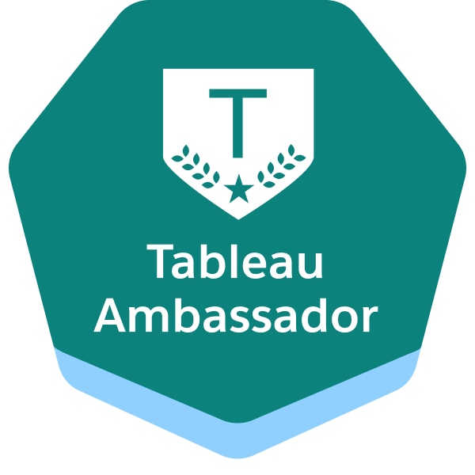

## Hi, I'm Shola✌🏾
#### Where data meets design — and strategy speaks 

<small>Currently building **[Majórem.ai](http://majorem.ai/)**, a consulting venture that helps organisations cut through noise and turn complexity into clarity.

Through data visualisation, commercial storytelling, and AI-driven insight, we focus on ROI, efficiency, and impact. On GitHub I share calculation blueprints, viz design experiments, and planning frameworks that reflect both our client work and my journey in shaping data into actionable strategy.</small>

## Accolades

  

## Stack

  
  
  
  
  
  

## Contact
<small>Got a data, AI, or analytics project in mind—or want to super-charge your dashboards, strategy, or insight workflows? We’d love to help. Email **studio@majorem.ai** and we’ll get back to you to explore the best way forward.</small>

<em>strategy in data’s language 💜</em>

<!--
**majoremai/majoremai** is a ✨ _special_ ✨ repository because its `README.md` (this file) appears on your GitHub profile.

Here are some ideas to get you started:

- 🔭 I’m currently working on ...
- 🌱 I’m currently learning ...
- 👯 I’m looking to collaborate on ...
- 🤔 I’m looking for help with ...
- 💬 Ask me about ...
- 📫 How to reach me: ...
- 😄 Pronouns: ...
- ⚡ Fun fact: ...
-->
